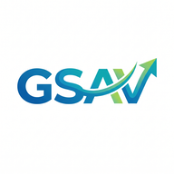

<div align="center">



# GSAV — Budget Spending Navigator

**Personal financial OS untuk mahasiswa.**  
Catat pengeluaran dalam hitungan detik. Pantau burn rate. Kelola budget. Dapat insight otomatis.

[](https://nextjs.org)
[](https://www.typescriptlang.org)
[](https://supabase.com)
[](https://tailwindcss.com)
[](https://web.dev/progressive-web-apps)

</div>

---

## ✨ Tentang GSAV

GSAV dirancang dengan prinsip **"Low Friction, High Insight"** — input transaksi harus secepat mungkin, dan insight keuangan harus otomatis tersedia.

Dibangun khusus untuk mahasiswa yang:
- Punya uang bulanan / sangu yang perlu dikelola
- Tidak mau ribet buka aplikasi yang kompleks
- Ingin tahu kapan uang mereka bakal habis
- Lebih suka tampilan gelap dan minimalis

---

## 🚀 Fitur Utama

### ⚡ Quick Add — Input Satu Baris
Ketik di bar bawah, transaksi langsung tercatat:

```
makan 15000          → Pengeluaran · Makan · Rp 15.000
transport 8k         → Pengeluaran · Transport · Rp 8.000
nongkrong 50000 boba → Pengeluaran · Nongkrong · Rp 50.000 (catatan: boba)
gaji 1.5jt           → Pemasukan · Rp 1.500.000
```

### 🔥 Burn Rate & Estimasi Habis
Kalkulasi otomatis berapa lama saldo kamu bertahan berdasarkan pola pengeluaran nyata, bukan asumsi.

```
Burn Rate Harian  = Total Pengeluaran Bulan Ini ÷ Hari Berjalan
Estimasi Habis    = Saldo Sekarang ÷ Burn Rate Harian
```

### 💡 Insight Otomatis
7 aturan finansial berjalan di background dan memunculkan peringatan/tips relevan:
- Saldo kritis (≤ 3 hari tersisa)
- Budget kategori hampir habis (≥ 80%)
- Pengeluaran hari ini lebih tinggi dari rata-rata
- Notifikasi belum catat transaksi hari ini
- Apresiasi kalau pengeluaran lebih hemat dari biasanya

### 📊 Analitik Visual
- Bar chart pengeluaran harian sepanjang bulan
- Donut chart breakdown per kategori
- Progress bar per kategori + persentase
- Kategori "paling boros" bulan ini

### 💰 Budget per Kategori
Set limit bulanan per kategori. GSAV akan memperingatkan saat mendekati atau melewati batas.

---

## 🖥️ Tech Stack

| Layer | Teknologi |
|---|---|
| Framework | [Next.js 14](https://nextjs.org) (App Router) |
| Language | [TypeScript 5](https://www.typescriptlang.org) |
| Styling | [Tailwind CSS](https://tailwindcss.com) (custom dark design system) |
| Database & Auth | [Supabase](https://supabase.com) (PostgreSQL + RLS) |
| Server State | [TanStack Query](https://tanstack.com/query) |
| Animations | [Framer Motion](https://www.framer.com/motion) |
| Charts | [Recharts](https://recharts.org) |
| Icons | [Lucide React](https://lucide.dev) |
| PWA | [next-pwa](https://github.com/shadowwalker/next-pwa) |
| Notifications | [react-hot-toast](https://react-hot-toast.com) |

---

## 🛠️ Panduan Setup

### Prasyarat
- Node.js 18+
- Akun [Supabase](https://supabase.com) (gratis)

### 1. Clone & Install

```bash
git clone https://github.com/username/gsav.git
cd gsav
npm install
```

### 2. Setup Database Supabase

1. Buat project baru di [supabase.com](https://supabase.com/dashboard)
2. Buka **SQL Editor** → New Query
3. Paste isi file [`supabase/schema.sql`](./supabase/schema.sql) → **Run**

> Schema akan otomatis membuat semua tabel, RLS policies, trigger auto-create profil, dan seed 9 kategori default saat user baru mendaftar.

### 3. Konfigurasi Environment

```bash
cp .env.local.example .env.local
```

Isi `.env.local` dengan kredensial dari **Supabase Dashboard → Project Settings → API**:

```env
NEXT_PUBLIC_SUPABASE_URL=https://xxxxxxxx.supabase.co
NEXT_PUBLIC_SUPABASE_PUBLISHABLE_KEY=sb_publishable_xxxxx...
```

### 4. Jalankan Development Server

```bash
npm run dev
```

Buka [http://localhost:3000](http://localhost:3000) di browser.

---

## 📱 Install di iPhone (PWA)

1. Buka URL app di **Safari** (wajib Safari, bukan Chrome)
2. Tap ikon **Share** (kotak dengan panah atas)
3. Scroll ke bawah → pilih **"Add to Home Screen"**
4. Beri nama **GSAV** → tap **Add**
5. Buka dari Home Screen → tampil fullscreen seperti app native 🎉

---

## 🚢 Deploy ke Vercel

```bash
# 1. Push ke GitHub
git add .
git commit -m "feat: initial release"
git push origin main

# 2. Import di vercel.com → New Project → pilih repo
# 3. Set Environment Variables (sama dengan .env.local)
# 4. Deploy
```

---

## 📁 Struktur Proyek

```
gsav/
├── app/
│   ├── (auth)/
│   │   ├── login/           # Halaman login
│   │   └── register/        # Halaman register
│   ├── (app)/
│   │   ├── dashboard/       # Dashboard utama
│   │   ├── transactions/    # List & kelola transaksi
│   │   ├── analytics/       # Charts & analitik
│   │   ├── budget/          # Budget per kategori
│   │   └── settings/        # Profil & pengaturan
│   ├── auth/callback/       # Supabase auth handler
│   ├── layout.tsx           # Root layout + PWA meta
│   └── globals.css          # Design system global
│
├── components/
│   ├── ui/                  # Atom components
│   │   ├── Card.tsx
│   │   ├── Badge.tsx
│   │   ├── ProgressBar.tsx
│   │   ├── BottomSheet.tsx
│   │   ├── EmptyState.tsx
│   │   └── DynamicIcon.tsx  # Lucide icon renderer
│   ├── dashboard/
│   │   ├── BalanceCard.tsx  # Saldo + income/expense
│   │   └── InsightBanner.tsx
│   ├── transactions/
│   │   ├── QuickAddBar.tsx  # Input cepat 1 baris
│   │   ├── TransactionModal.tsx
│   │   ├── TransactionList.tsx
│   │   └── TransactionItem.tsx
│   └── shared/
│       ├── BottomNav.tsx    # Navigasi bawah
│       └── FAB.tsx          # Floating action button
│
├── lib/
│   ├── hooks/               # Data hooks (TanStack Query)
│   │   ├── useTransactions.ts
│   │   ├── useCategories.ts
│   │   ├── useBudget.ts
│   │   └── useProfile.ts
│   ├── supabase/            # Client helpers
│   │   ├── client.ts
│   │   └── server.ts
│   └── utils/
│       ├── currency.ts      # Parser & formatter IDR
│       ├── date.ts          # Date utilities
│       ├── quick-parser.ts  # "makan 15k" → objek transaksi
│       └── insights-engine.ts # 7 aturan insight finansial
│
├── types/index.ts           # TypeScript types
├── middleware.ts             # Auth route protection
├── supabase/schema.sql      # Database schema lengkap
└── public/
    ├── manifest.json         # PWA manifest
    └── icons/               # App icons
```

---

## 🗄️ Database Schema

```sql
profiles        -- Data profil user (nama, uang bulanan)
categories      -- Kategori transaksi per user
transactions    -- Semua transaksi (income & expense)
budgets         -- Budget limit per kategori per bulan
insights        -- Cache insights yang dihasilkan
```

Semua tabel dilindungi oleh **Row Level Security (RLS)** — data setiap user terisolasi sepenuhnya.

---

## 🧠 Cara Kerja Insight Engine

```typescript
// 7 rules yang berjalan setiap kali data diload
rules = [
  'low-balance-critical',    // Saldo habis ≤ 3 hari
  'low-balance-warning',     // Saldo habis 4-7 hari
  'budget-almost-exhausted', // Budget ≥ 80% terpakai
  'high-daily-spending',     // Hari ini > rata-rata × 1.3
  'no-transaction-today',    // Belum catat hari ini
  'good-spending',           // Pengeluaran < 70% dari biasanya
  'on-track',                // Saldo cukup untuk > sisa hari bulan ini
]
```

---

## 📄 Lisensi

MIT © 2026 — Dibuat dengan ☕ dan keinginan untuk tidak bokek.

---

<div align="center">
  <sub>GSAV — Budget Spending Navigator | Mobile-first PWA untuk mahasiswa</sub>
</div>
